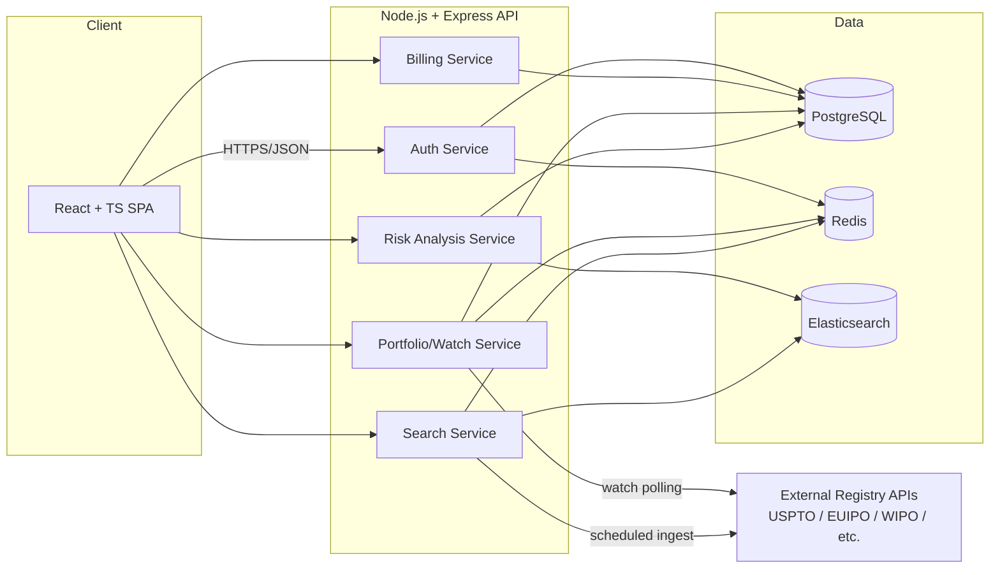

# Technical Requirements Document (TRD)
## Intellectual Property Research Platform

| | |
|---|---|
| **Version** | 1.0 |
| **Date** | July 30, 2026 |
| **Companion doc** | 01-product-requirements-document.md |

> Robert C. Martin's *Clean Architecture* makes the point plainly: the framework, the database, and the web are details — the business rules are the point. This TRD keeps the search/risk/portfolio domain logic independent of Elasticsearch, Postgres, and Express, so any one of those can be swapped later without touching the core.

---

## 1. Confirmed Technology Stack (per agreement)

| Layer | Technology | Notes |
|---|---|---|
| Backend | Node.js + Express | REST API, versioned (`/api/v1/...`) |
| Search Engine | Elasticsearch | Full-text + fuzzy/phonetic matching, similarity scoring |
| Primary Database | PostgreSQL | System of record: users, portfolios, watches, billing |
| Cache / Session Store | Redis | Query cache, session/rate-limit store, job queue backing |
| Frontend | React.js + TypeScript | SPA, component-driven |
| Visualization | D3.js or Recharts | Dashboards, portfolio analytics |
| Hosting | AWS or Google Cloud | Final choice locked in Phase 1 (Discovery) |

## 2. High-Level Architecture

## 3. Non-Functional Requirements

### 3.1 Performance
- Search P95 response time < 2s for a single-jurisdiction query; < 5s federated across all connected sources
- Dashboard load P95 < 1.5s (cached aggregates, not live recompute per view)

### 3.2 Availability
- 99.5% uptime SLA during the paid renewal period (contractual)
- Multi-AZ deployment; health-checked auto-restart for API and worker processes

### 3.3 Security
Given the platform will hold client/matter data and portfolio information, security is treated as a first-class requirement, not a Phase-4 add-on:
- OWASP Top 10 addressed by design (injection, broken auth, sensitive data exposure, etc.), not just tested for at the end
- TLS in transit; encryption at rest for PostgreSQL and any exported PDFs stored server-side
- Role-based access control: Admin / Attorney / Viewer, enforced at the API layer, not just hidden in the UI
- Rate limiting and brute-force protection on auth endpoints (Redis-backed)
- Independent security audit scheduled in Phase 4 (weeks 9–12), with findings triaged before deployment sign-off
- Audit log of sensitive actions (portfolio changes, exports, user/role changes)

### 3.4 Data Handling
- Trademark data sourced under licenses paid by the client (per agreement) — the system must record source/attribution per record, both for correctness and because licensing terms may restrict redistribution
- Multi-jurisdiction data normalized to a common internal schema (see 05-backend-schema.md) regardless of source format

## 4. Search & Similarity Engine Requirements

- **Indexing:** Elasticsearch index per data source, plus a normalized composite index for cross-source federated search
- **Matching techniques required (not exact-match only):**
  - Exact and partial text match
  - Phonetic algorithms (e.g., Soundex/Metaphone-style) for sound-alike marks
  - Edit-distance / fuzzy matching (Levenshtein) for visual near-misses
  - Nice Classification (goods/services class) overlap as a first-class filter, not an afterthought
- **Confusion Risk scoring:** composite score derived from the above, mapped to a Low/Medium/High rating with the matched marks and rationale surfaced to the user — never a bare number

## 5. Integration Requirements

- Adapter pattern per external registry (each source behind its own module implementing a common interface), so adding a new jurisdiction is additive, not a rewrite
- Scheduled ingestion/sync jobs (queued via Redis) for registry updates powering the Watch feature
- Graceful degradation: if one source is unavailable, federated search returns partial results with a clear "source unavailable" flag rather than failing the whole query

## 6. Authentication & Billing

- JWT-based auth with refresh tokens; sessions backed by Redis
- Firm-level tenancy: one firm account, multiple seats, role-scoped permissions
- Subscription billing integration (provider selection — e.g., Paystack for NGN, Stripe if USD billing is needed — confirmed in Phase 1 alongside hosting choice)

## 7. Testing Requirements (Phase 4)

- Unit tests on domain logic (search ranking, risk scoring) independent of Elasticsearch/Postgres specifics
- Integration tests against a seeded Elasticsearch/Postgres test environment
- Security audit: dependency scanning, auth/session penetration checks, access-control verification
- Load testing against the P95 targets in Section 3.1 before go-live

## 8. Deployment Architecture

- Containerized services (Docker), deployed to AWS or GCP (decision locked in Phase 1)
- CI/CD pipeline: lint → test → build → deploy, with a staging environment gating production
- Infrastructure as code recommended for reproducibility of the environment during the yearly renewal/maintenance period

## 9. Documentation Deliverables (Phase 4)

- API reference (endpoints, auth, error codes)
- Deployment/runbook documentation for the hosting environment chosen
- Training materials for firm administrators (per agreement's "Documentation & Training" line item)
