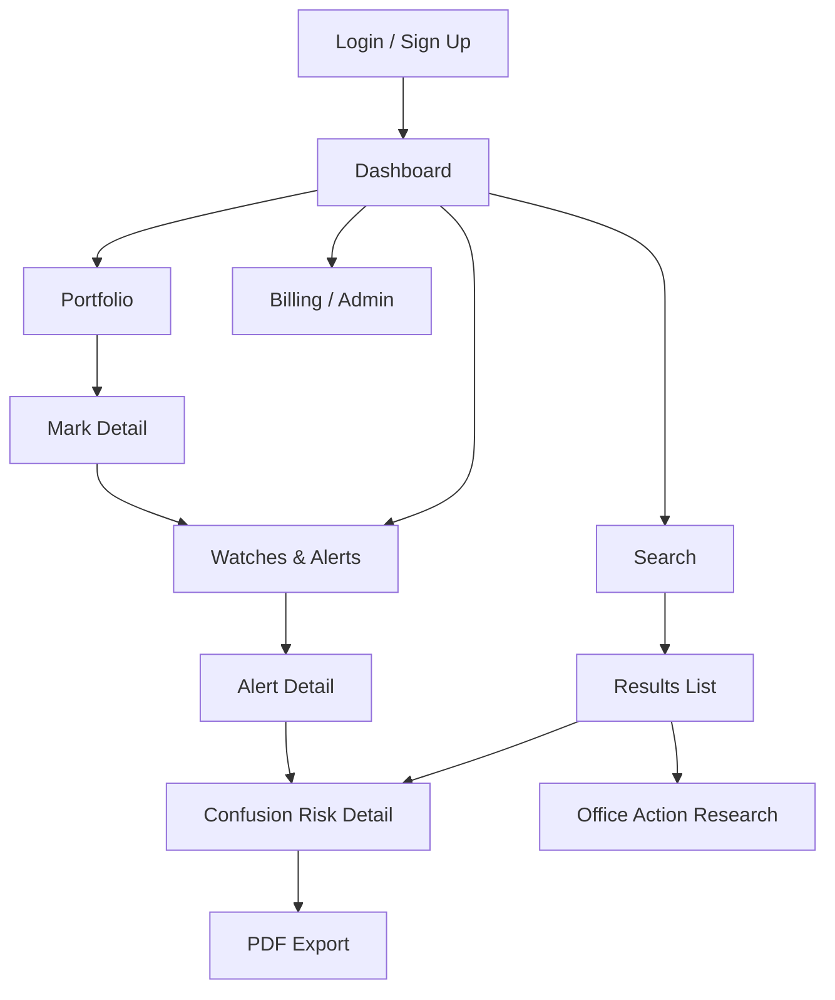
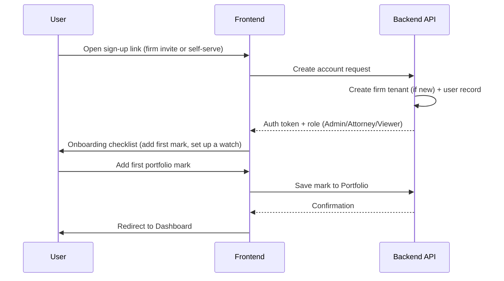
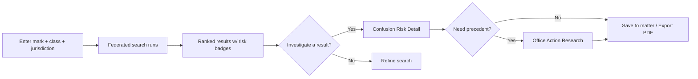

# App / Website Flow
## Intellectual Property Research Platform

| | |
|---|---|
| **Version** | 1.0 |
| **Date** | July 30, 2026 |

This document maps the primary user journeys so that frontend, backend, and UI work (Phases 2–3) build against the same shared picture of how a session actually moves.

---

## 1. Top-Level Navigation Map

## 2. Journey: New User Onboarding

**Notes for implementation:**
- First-run experience should get a user to *one* completed action (a search or a portfolio entry) before showing an empty dashboard — an empty state is a dead end, not a welcome.
- Admin role is the only one that can invite additional seats.

## 3. Journey: Clearance Search → Confusion Risk → Export

1. **Search entry** — user enters a proposed mark name, selects jurisdiction(s) and goods/services class.
2. **Federated query** — backend fans the query out to connected registry adapters and the internal Elasticsearch index; partial results stream in as sources respond.
3. **Results list** — ranked by relevance, with a Low/Medium/High risk badge per candidate.
4. **Confusion Risk detail** — user opens a candidate to see the matched marks, similarity basis (phonetic/visual/class overlap), and supporting evidence — never just a number.
5. **Decision point** — user either discards the candidate, saves it to a matter file, or proceeds to Office Action research for precedent.
6. **Export** — user generates a PDF of the search + risk findings, suitable to attach to client correspondence.

## 4. Journey: Portfolio & Watch Setup

1. User adds an owned mark to their **Portfolio** (manually or by importing from a completed search).
2. User optionally converts a portfolio entry into a **Watch** — the system will monitor new filings against it.
3. On a match, the system generates an **Alert**, routed by the user's chosen channel (email/in-app).
4. Opening an alert takes the user straight into the **Confusion Risk Detail** view for the conflicting filing — the watch loop and the search loop share the same risk-detail screen rather than duplicating it.

## 5. Journey: Billing & Admin (Firm Administrator only)

1. Admin views current seat usage and subscription tier.
2. Admin invites/removes seats and assigns roles.
3. Admin views usage-based reporting (searches run, watches active) to inform renewal decisions.

## 6. Cross-Cutting Rule

Every screen that surfaces a risk score must show its evidence inline (matched marks, class overlap, similarity basis) rather than requiring a click-through — this was flagged as a trust requirement in the PRD (Section 5.2) and should be treated as a UI constraint, not a nice-to-have.
