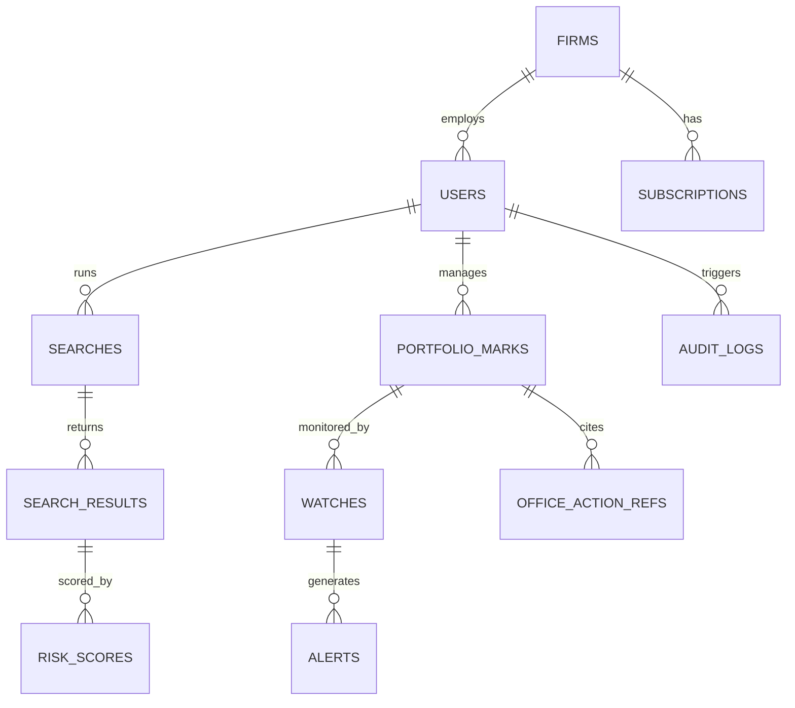

# Backend Schema
## Intellectual Property Research Platform

| | |
|---|---|
| **Version** | 1.0 |
| **Date** | July 30, 2026 |
| **Companion doc** | 02-technical-requirements-document.md |

Three data stores, three jobs: PostgreSQL is the system of record, Redis is the fast/ephemeral layer, Elasticsearch is the search/similarity engine. Nothing lives in two places as a source of truth — Elasticsearch documents are derived from Postgres, never the other way around.

---

## 1. Entity-Relationship Overview



## 2. PostgreSQL Tables (System of Record)

### `firms`
| Column | Type | Notes |
|---|---|---|
| id | uuid PK | |
| name | text | |
| subscription_tier | text | |
| created_at | timestamptz | |

### `users`
| Column | Type | Notes |
|---|---|---|
| id | uuid PK | |
| supabase_user_id | uuid, unique, nullable | canonical link to the verified Supabase Auth user during migration; no cross-database FK |
| firm_id | uuid FK → firms | |
| email | text, unique | |
| password_hash | text, nullable | legacy local credential only; new Supabase-managed identities leave it null pending column removal |
| role | enum('admin','attorney','viewer') | enforced at API layer per TRD §3.3 |
| created_at | timestamptz | |
| last_login_at | timestamptz | |

### `portfolio_marks`
| Column | Type | Notes |
|---|---|---|
| id | uuid PK | |
| firm_id | uuid FK | |
| owner_user_id | uuid FK → users | |
| mark_text | text | |
| jurisdiction | text | ISO country/region code |
| nice_classes | int[] | Nice Classification classes |
| status | text | e.g. filed/registered/abandoned |
| filing_date | date | |
| renewal_date | date | drives deadline flags in UI |
| source_registry | text | attribution, per TRD §3.4 |

### `watches`
| Column | Type | Notes |
|---|---|---|
| id | uuid PK | |
| portfolio_mark_id | uuid FK | |
| user_id | uuid FK | owner of the watch config |
| alert_channel | text | email / in-app / (future: sms) |
| alert_mode | text | real-time / digest |
| active | boolean | |

### `alerts`
| Column | Type | Notes |
|---|---|---|
| id | uuid PK | |
| watch_id | uuid FK | |
| matched_filing_ref | text | external registry reference |
| risk_score_id | uuid FK → risk_scores | |
| read | boolean | |
| created_at | timestamptz | |

### `searches`
| Column | Type | Notes |
|---|---|---|
| id | uuid PK | |
| user_id | uuid FK | |
| query_text | text | |
| filters | jsonb | jurisdiction, class, date range |
| created_at | timestamptz | |

### `search_results` (cached snapshot of what was shown, for audit/export)
| Column | Type | Notes |
|---|---|---|
| id | uuid PK | |
| search_id | uuid FK | |
| candidate_mark_text | text | |
| candidate_source | text | |
| candidate_ref | text | external ID in source registry |

### `risk_scores`
| Column | Type | Notes |
|---|---|---|
| id | uuid PK | |
| search_result_id | uuid FK, nullable | |
| alert_id | uuid FK, nullable | |
| phonetic_score | numeric | |
| visual_score | numeric | |
| class_overlap | boolean | |
| composite_rating | enum('low','medium','high') | |
| matched_mark_refs | jsonb | evidence shown in UI per PRD §5.2 |

### `office_action_refs`
| Column | Type | Notes |
|---|---|---|
| id | uuid PK | |
| portfolio_mark_id | uuid FK | |
| reference_text | text | |
| examiner_reasoning_summary | text | |
| linked_precedent_ref | text | |

### `subscriptions`
| Column | Type | Notes |
|---|---|---|
| id | uuid PK | |
| firm_id | uuid FK | |
| seats_licensed | int | |
| billing_provider | text | confirmed in Phase 1 |
| status | text | active/past_due/canceled |
| renewal_date | date | ties to the yearly renewal line in the agreement |

### `audit_logs`
| Column | Type | Notes |
|---|---|---|
| id | uuid PK | |
| user_id | uuid FK | |
| action | text | e.g. "portfolio.update", "export.generate" |
| target_ref | text | |
| created_at | timestamptz | |

## 3. Redis Usage

| Key pattern | Purpose | TTL |
|---|---|---|
| `session:{token}` | Auth session | sliding, matches refresh-token lifetime |
| `ratelimit:{ip or user}` | Auth/brute-force protection (TRD §3.3) | rolling window |
| `search:cache:{query_hash}` | Federated search result cache | short (minutes) — balances freshness vs. registry load |
| `queue:watch_ingest` | Job queue for scheduled watch/registry polling | n/a (queue, not cache) |

## 4. Elasticsearch Indices

### `trademarks_composite` (federated search index)
```json
{
  "mark_text": "text + phonetic analyzer",
  "owner": "keyword",
  "jurisdiction": "keyword",
  "nice_classes": "integer[]",
  "status": "keyword",
  "filing_date": "date",
  "source_registry": "keyword",
  "similarity_vector": "dense_vector"
}
```
- `mark_text` indexed with both a standard analyzer and a phonetic analyzer to support the fuzzy/phonetic matching required in the TRD
- `similarity_vector` reserved for a semantic/embedding-based similarity pass if the phonetic + edit-distance approach needs a second signal later

### `office_actions`
```json
{
  "reference_text": "text",
  "examiner_reasoning": "text",
  "related_classes": "integer[]",
  "related_marks": "keyword[]"
}
```

## 5. Data Flow Note

Registry ingestion writes to PostgreSQL first (as the attributed, licensed source of truth), then a sync job projects the relevant fields into Elasticsearch for search/matching. This keeps licensing attribution (TRD §3.4) intact even though the search experience is Elasticsearch-driven.
