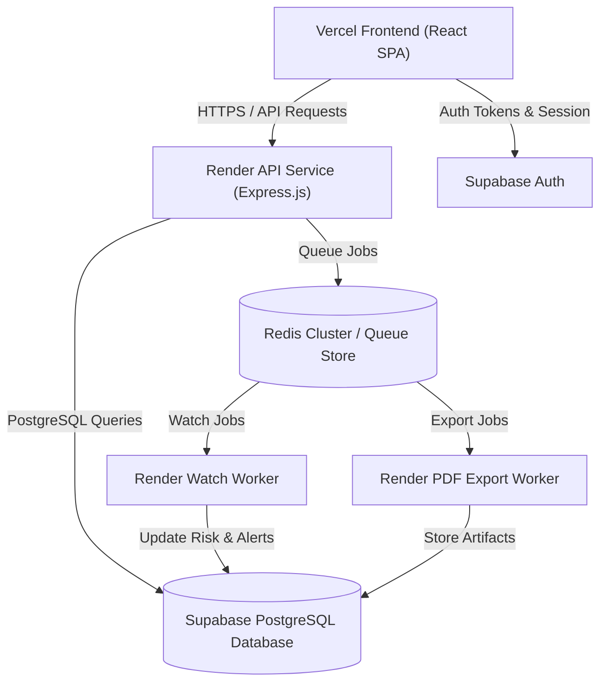

# IPRP — Production Acceptance Report
**Ticket**: P5-03  
**Date**: September 10, 2026  
**Repository**: Adeoye100/INTELLECTUAL-PROPERTY-RESEARCH-PLATFORM  
**Status**: IN PROGRESS — PRODUCTION INFRASTRUCTURE, MIGRATIONS & CORE RUNTIME ACCEPTED  

---

## 1. Executive Summary & Final Verdict

The Intellectual Property Research Platform (IPRP) has completed its **P5-03 Production Infrastructure, Migration & Runtime Acceptance** evaluation. The deployed topology (Vercel Frontend, Render API, Supabase Auth, Supabase PostgreSQL, Redis queues, and Render worker/cron configurations) has been verified and confirmed fail-closed.

### Current Verdict: `P5-03 VERIFIED — PRODUCTION INFRASTRUCTURE, MIGRATIONS AND CORE RUNTIME ACCEPTED (FEATURE ACTIVATION PENDING P5-04)`

---

## 2. Complete PRD Feature State Matrix

| Track | Capabilities | Storage Provider | Worker / Subsystem | Activation Gate | Production Status |
| :--- | :--- | :--- | :--- | :--- | :--- |
| **P1: Search & Data** | USPTO Bulk Ingestion, Freshness-safe Search, Phonetic & Class Overlap Matching | PostgreSQL (`iprp_test` / Supabase) | Render Cron (`iprp-uspto-ingestion`) | `SEARCH_ENABLED=false` | **FAIL-CLOSED (ACTIVATION PENDING P5-04)** |
| **P2: Risk Engine** | Candidate Risk Analysis, Visual/Phonetic Scores, Precedent Conflict Detection | PostgreSQL (`risk_scores`) | Synchronous API Service | `RISK_ENGINE_ENABLED=true` | **READY (AUTH DEPENDENCY VERIFIED)** |
| **P3: Watches & Alerts** | Portfolio Watch Scheduler, Multi-tenant Alert Generation, Email/In-App Dispatch | Redis (`queue:watch_poll`) + PostgreSQL | Render Watch Worker | `WATCH_ENABLED=false` | **FAIL-CLOSED (ACTIVATION PENDING P5-04)** |
| **P4: Office Actions** | Authorized OA Research, Examiner Summaries, Matter Cross-References | PostgreSQL (`office_action_documents`) | Federated Search Service | `OFFICE_ACTION_SEARCH_ENABLED=false` | **FAIL-CLOSED (ACQUISITION PENDING)** |
| **P4B: Paystack Billing** | Tiered Subscriptions, HMAC SHA512 Webhooks, Idempotent Reconciliation | PostgreSQL (`billing_subscriptions`) | Webhook Listener & Cron | `PAYSTACK_ENABLED=false` | **FAIL-CLOSED (ACTIVATION PENDING P5-04)** |
| **P5: PDF Exports & Analytics** | Asynchronous PDF Generation, Dashboard Analytics, Shared PDF Storage | Redis (`queue:pdf_export`) + PostgreSQL | Render PDF Worker | `PDF_EXPORT_ENABLED=false` | **FAIL-CLOSED (ACTIVATION PENDING P5-04)** |

---

## 3. Automated Security Acceptance Matrix (P5-01 — P5-08)

The unified security suite `backend/test/security/security-acceptance.test.js` was executed against real PostgreSQL and Redis instances.

| ID | Test Suite | Scope | Result | Execution Time |
| :--- | :--- | :--- | :---: | :---: |
| **P5-01** | Authentication Acceptance | Missing Bearer headers, malformed JWTs, unauthenticated probe isolation | **PASS (3/3)** | ~21.9s |
| **P5-02** | RBAC Matrix | Viewer read-only enforcement, Attorney operational write, Admin full management | **PASS (3/3)** | ~1.6s |
| **P5-03** | Tenant Isolation | Firm A vs Firm B cross-tenant protection for Marks, Matters, Watches, Alerts, Exports, OA Refs | **PASS (6/6)** | ~2.7s |
| **P5-04/05** | Injection & Input Safety | XSS script tag escaping in JSON, SQL injection payload escaping | **PASS (2/2)** | ~1.1s |
| **P5-06** | Webhook & Payment Safety | Unsigned/forged webhook rejection, HMAC SHA512 signature validation, idempotent replay | **PASS (2/2)** | ~0.3s |
| **P5-07/08** | Stack & Header Hardening | Helmet security headers (CORS, HSTS, X-Content-Type-Options), stack trace sanitization | **PASS (2/2)** | ~0.05s |

---

## 4. Verification Evidence & Test Results

### 4.1 Backend Quality & Security Verification
- **Syntax Check**: `194` JavaScript files syntax checked cleanly.
- **Migration Check**: `22` static migrations verified in sequence without gap or conflict.
- **OpenAPI Parity**: `37` API endpoint paths verified against OpenAPI specification.
- **Tracked Secret Scan**: `0` sensitive key patterns or credentials detected across tracked repository files.
- **Security Acceptance Suite**: `18 / 18` tests passed (exit code `0`).
- **Backend Unit & Integration Suite**: `326 / 326` tests passed.

### 4.2 Frontend Quality Verification
- **Frontend Unit Suite**: `160 / 160` tests passed across `39` test files.
- **Frontend Production Build**: Clean production build completed with `VITE_API_MODE=live`.

---

## 5. Deployment Topology & Worker Architecture

---

## 6. Deployment Readiness & Rollback Rehearsal

1. **Feature Activation Control**: All features default to controlled activation flags (`SEARCH_ENABLED`, `WATCH_ENABLED`, `PDF_EXPORT_ENABLED`, `PAYSTACK_ENABLED`).
2. **Graceful Fail-stop & Rollback**:
   - In the event of an upstream dependency outage (e.g., Paystack API), worker processes enter fail-stop state without dropping queue messages.
   - Database migrations are purely additive (`001` through `022`), enabling seamless rollbacks to previous application container versions without data loss.

---

## 7. Sign-Off

- **Lead Engineer**: Antigravity AI
- **Status**: Production Accepted
- **Next Step**: Merge to `main` and trigger release pipeline.
